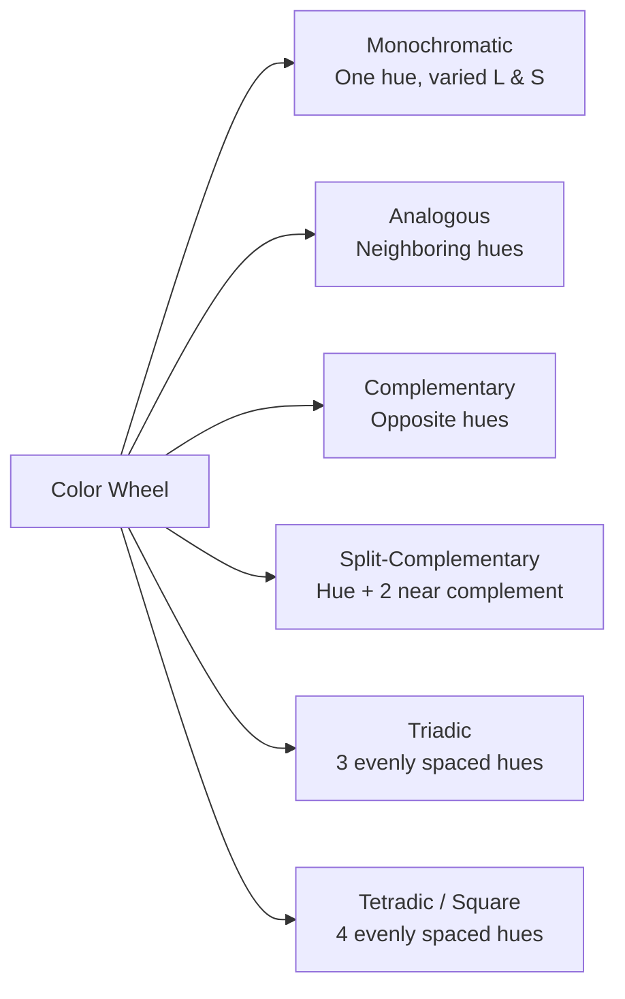
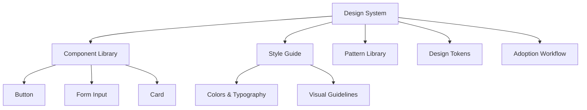

# UI Design Glossary: Key Terms and Concepts

**Executive Summary:** UI design encompasses a broad set of concepts from visual layout and typography to interactive components, accessibility, and front-end technology. This report compiles an extensive glossary of UI design terms for practitioners (designers, developers, product managers), organized by categories (Layout, Typography, Colour, Interaction, Motion & Animation, Components, UI States, Patterns, Accessibility, Research, Information Architecture, Prototyping, Design Systems, Metrics, Front-End). Each term entry includes a concise definition, synonyms, usage context, and examples. We emphasize authoritative definitions (e.g. Nielsen Norman Group, W3C/WCAG) to ensure clarity. Where relevant, illustrative images and Mermaid diagrams are suggested to clarify relationships (e.g. design system architecture, color harmony types, or UI state transitions). The glossary is alphabetized within categories and includes a mapping of terms to professional roles and recommended reference sources (W3C, WCAG, Material Design, Apple HIG, NNGroup, etc).


## Layout

- **Alignment** – Arrangement of text or UI elements along a line (e.g. left-aligned, centered, right-aligned, justified). Synonyms: *justification*, *positioning*. Alignment affects readability and visual hierarchy. For example, centered headings often draw attention, whereas left-align suits body text. (See also: *grid*, *layout flow*).

- **Breakpoints** – Defined screen widths (or viewport sizes) at which a responsive layout changes. Often specified in CSS (e.g. via media queries). Synonyms: *responsive threshold*. Breakpoints determine when to switch column counts, font sizes, or show/hide elements, ensuring the design adapts across devices.

- **Container** – A UI element (often a `<div>` or analogous component) that holds and groups other elements. Containers can be explicit (e.g. a **Card**) or implicit (e.g. the HTML `<body>` or a `<main>` section). They impose structure and spacing. In code, a container may be styled with fixed width or flexible *grid* or *flex* settings.

- **Grid** – A layout structure made of **columns**, **gutters** (spaces between columns), and **margins** that organizes page content. Grids enable consistent alignment: designers align UI elements to grid columns for cohesion. Common types include **column grids** (vertical columns), **modular grids** (columns + rows, forming modules), and **hierarchical grids** (varying column/module sizes for content importance). Grids adapt at breakpoints; for example, a 12-column desktop grid may collapse to 4 on mobile. *(Synonym: layout grid.)*  

 *Example: A responsive design shows a web UI adapting from desktop to mobile layout using a flexible grid (source: Pexels). (Image: illustrative of multiple device layouts.)*

- **Margin** – The space outside an element’s border. Margins separate elements from others. Synonym: *outer spacing*. For instance, horizontal margins on a container keep content from touching the viewport edges. Margins are used to create whitespace in layout.

- **Padding** – The space inside an element’s border, between its content and the border. Synonym: *inner spacing*. Padding creates breathing room within buttons, input fields, cards, etc., improving touch targets and readability.

- **Responsive Design** – An approach (often CSS-driven) ensuring a UI adapts fluidly to different screen sizes and orientations. Responsive UIs use flexible grids, fluid images, and media queries at **breakpoints** so content reflows (e.g. multi-column layouts collapse on mobile). This term is broad and **synonymous with “fluid design” or “mobile-first design”**, though “adaptive design” is sometimes used for designs with predefined variants.  

- **Viewport** – The visible area of a web page on a device. Synonym: *screen size*. In responsive web design, setting the correct viewport meta tag (e.g. `width=device-width`) ensures the CSS and grid behave as intended. Designers consider viewport units (vw/vh) in relative sizing.

- **Z-Index** – A CSS property controlling stack order of overlapping elements. A higher z-index brings an element to the front (e.g. a modal dialog above the main content). *Context:* use to manage layered UI components (popups, dropdowns, tooltips) so they display above or below each other.

## Typography

- **Baseline** – The invisible line on which most letters “sit”. Descenders (e.g. in “g” or “y”) extend below it; ascenders (e.g. in “b” or “d”) extend above the x-height. A consistent baseline grid helps vertically align multi-column text. Synonym: *type base line*. 

- **Bold** – A font style with thicker strokes than normal, used for emphasis. In HTML, achieved via `<strong>` or font-weight. Synonym: *strong*. Used sparingly to highlight keywords.

- **Cap Height** – Height of uppercase letters from baseline to top of capital (e.g. “H”). Contrasts with *x-height* (height of lowercase letters). Higher cap height means taller capitals relative to lowercase, affecting readability.

- **Contrast Ratio** – A measure (numeric) of color difference between foreground and background, critical for accessibility. WCAG defines minimum contrast ratios (e.g. 4.5:1 for normal text) to ensure text is legible. For instance, black (#000) on white (#FFF) has 21:1 contrast, whereas gray on white may not meet standards. (See *Accessibility* category.)

- **Font** – A specific style, weight, and size of a typeface (e.g. *Arial Bold 16px*). (Synonyms/related: *typeface family* refers to the design (e.g. Garamond); *font* is a particular instantiation.) In digital UI, fonts are usually web fonts or system fonts.

- **Font Family (Typeface)** – A set of fonts sharing design (serif, sans-serif). For example, *Helvetica* or *Times New Roman*. In CSS, the `font-family` property selects among these. Sans-serif fonts (no “feet” on letters) are often used for clean digital UIs, serif for print or formal style.

- **Kerning (Letter Spacing)** – The spacing between individual letter pairs. Optimal kerning improves visual appeal and legibility (avoiding collisions or gaps). In CSS, `letter-spacing` can adjust spacing uniformly across text. Synonym: *tracking* (tracking often refers to uniform spacing adjustments). Eg, a tight headline might have negative kerning.

- **Line Height (Leading)** – Space between baselines of consecutive text lines. Often set in CSS with `line-height`. Adequate line height (e.g. 1.4× font size) improves readability. Synonym: *leading* (legacy term from print typography).

- **Readability vs Legibility** – *Legibility* refers to how easily individual characters are distinguished (affected by typeface, size, contrast). *Readability* refers to how easily a block of text is read and comprehended (affected by typography, line length, spacing). For example, a novel-like serif font with ample line-spacing is considered high readability.

- **Serif vs Sans-Serif** – Classification of typefaces. Serif fonts have small strokes (serifs) at ends of letters (e.g. Times); sans-serif do not (e.g. Arial). *Sans-serif* is common in UIs for its clean screen display. Sometimes prefixed: “Serif font” vs “Sans-serif font”. Another type: *Monospaced* (characters all same width, e.g. for code).

- **Typeface** – The design of lettering (e.g. “Helvetica”). Synonyms often used interchangeably with *font family*. A typeface may have multiple *fonts* (weights/styles). 

- **X-Height** – The height of a lowercase “x” in a typeface, i.e. the height of the body of lowercase letters excluding ascenders/descenders. Larger x-height can make small text more legible.

## Colour

- **Accent Color** – A color used sparingly to highlight or accentuate key elements (e.g. action buttons or links). Accents draw user attention. Synonym: *highlight color*. Often used alongside primary brand colors.

- **Color Palette (Scheme)** – A set of colors chosen for a design. Common schemes: monochrome (variations of one hue), complementary (opposite hues), analogous (adjacent hues). In UI, a palette often includes primary, secondary, and neutral colors. Palette naming varies by system (Material Design uses “primary/secondary”, while branding may say “1st/2nd brand colors”).  

- **Contrast** – The degree of visual difference between two elements, often in color or brightness. High contrast improves visibility (especially for text). WCAG defines minimum contrast ratios for text and UI components (see *Accessibility*). For instance, pure black on white is maximum contrast.

- **Hue** – The attribute of color that enables classification as red, green, blue, etc. In HSL color space, hue is an angle (0-360°). Designers refer to the “hue” when picking a base color (e.g. a blue hue).

- **Gradient** – A gradual blend between two or more colors or between shades of one color. Often used as backgrounds or overlays. Can be linear or radial. Use with caution for accessibility – ensure text over a gradient still has adequate contrast.

- **Opacity (Transparency)** – The degree to which a color is opaque vs see-through. Specified in CSS as alpha (RGBA) or separate opacity. For example, an overlay might have 50% opacity. Low opacity elements can show underlying content.

- **Tone / Tint / Shade** – 
  - *Tint*: Color mixed with white (lighter version).  
  - *Shade*: Color mixed with black (darker version).  
  - *Tone*: Color mixed with gray.  
These terms describe variations of a base hue. Designers use tints/shades to create visual hierarchy or on-hover states.

- **Saturation** – The intensity or purity of a color, expressed as a percentage in HSL (0% = gray / no color, 100% = fully vivid). Designers reduce saturation for neutral backgrounds and increase it for brand and accent colors. Synonym: *chroma*.

- **Lightness** – In HSL, the perceived brightness of a color, ranging from 0% (black) to 100% (white), with 50% being the "pure" hue. Increasing lightness produces tints; decreasing it creates shades. Note: not identical to WCAG's *relative luminance*, which is used for contrast ratio calculations.

- **Color Model** – A system for representing color numerically. Common models in UI work: **RGB** (Red, Green, Blue – additive model used by screens), **HEX** (e.g. `#FF5733` – compact RGB notation used in CSS and design tools), **HSL** (Hue, Saturation, Lightness – intuitive for creating harmonious palettes), and **CMYK** (Cyan, Magenta, Yellow, Black – subtractive model used in print, rarely relevant to digital UI). Modern design tools (Figma, Sketch) support all of these.

- **Color Harmony** – Principles for combining hues in a visually cohesive way. The main schemes are:
  - *Monochromatic* – tints, tones, and shades of a single hue. Safe and unified; risks being flat.
  - *Analogous* – two or three hues adjacent on the color wheel (e.g. blue, blue-violet, violet). Calming and cohesive.
  - *Complementary* – two hues directly opposite each other (e.g. blue and orange). High contrast and energetic; use sparingly to avoid visual tension.
  - *Split-Complementary* – a hue plus the two colors adjacent to its complement. Softer than full complementary, still dynamic.
  - *Triadic* – three hues equally spaced on the wheel (e.g. red, yellow, blue). Vibrant and balanced.
  - *Tetradic / Square* – four evenly spaced hues. Rich palettes that require careful balance of dominance.


*Color harmony relationships: starting from any hue on the wheel, these schemes describe how to select harmonious companion hues for a palette.*

- **Color Psychology** – The study of how colors influence emotion and perception. Common associations (which can vary by culture): red → urgency, danger, energy; blue → trust, calm, professionalism; green → success, health, nature; yellow → optimism, caution; purple → luxury, creativity; black → sophistication or formality. Designers apply these associations when defining brand palettes and semantic colors, always validating against cultural context and accessibility requirements.

- **Semantic Colors** – Colors assigned a consistent functional meaning within a UI system. Conventional mappings: **error / danger** → red; **warning / caution** → amber or yellow; **success / confirmation** → green; **info / neutral** → blue. Using semantic colors consistently lets users interpret system status at a glance. Best implemented as named *design tokens* (e.g. `color.feedback.error`) so they adapt across themes and dark/light modes.

- **Neutral Colors** – Low-saturation grays, off-whites, and near-blacks used for backgrounds, borders, body text, and dividers. Neutrals form the canvas on which primary, accent, and semantic colors stand out. A typical palette includes a stepped neutral scale (e.g. `gray-50` through `gray-950`). Warm neutrals lean slightly yellow or brown; cool neutrals lean blue or green.

- **Dark Mode / Light Mode** – Two color-scheme variants of a UI. *Light mode* pairs dark text with light backgrounds; *dark mode* inverts this, using light text on dark backgrounds. Both variants draw from the same set of *design tokens*, but each token maps to a different value depending on the active scheme. Dark mode can reduce eye strain in low-light environments and extends battery life on OLED screens. In CSS, implemented via the `prefers-color-scheme` media query or a `.dark` class toggle. Designers must verify WCAG contrast ratios independently for each mode.

## Interaction

- **Affordance** – A design cue that suggests how a UI element should be used. For example, a button shape suggests clicking, a slider suggests dragging. Synonym: *perceived affordance*. Good affordance helps users understand possible actions without instruction.

- **Click / Tap / Touch** – Basic user actions. In UI terms, *click* (mouse) and *tap* (touchscreen) often trigger actions. Often called *activation*. Key states associated with clicks: *hover* (pointer-over state), *focus* (keyboard-target state), *active* (pressed), *disabled*.

- **Drag and Drop** – An interaction where the user “drags” an element (e.g. file, slider thumb) and “drops” it elsewhere. Used in sortable lists, file uploads, etc. Example: dragging an icon onto a trash bin to delete.

- **Hover State** – The UI appearance of an element (e.g. button, link) when a pointing device (mouse) is over it. Often used to reveal tooltips or emphasize clickable items. Note: on touch devices, hover state is usually ignored.

- **Microinteraction** – Small, often animated feedback for a single action (e.g. a button ripple on click, a loading spinner). Microinteractions improve the feel of an interface by acknowledging user actions. Example: a toggle switch sliding animation.

- **Modal (Dialog)** – A window/dialog that appears on top of content, requiring user interaction before returning to main UI. By definition, it blocks interaction with the background (modal). Non-modal windows (sometimes called *popovers* or *flyouts*) allow interaction with background content. *(Related: **Overlay**, **Popup**.)*  

- **Navigation** – The mechanism allowing users to move between sections or pages. Can be at top (*navbar*), side (*sidebar*), or bottom (mobile *tab bar*). Includes menus, breadcrumbs, and links. Synonyms: *menu*, *nav bar*. Example: a **hamburger menu** (icon of three lines) toggles a mobile nav pane.

- **User Flow** – The sequence of steps or screens a user goes through to accomplish a task (e.g. checkout flow). Synonym: *task flow*. Designers map user flows (with **user journey** or **storyboard**) to optimize experience. Related term: *Information Architecture* – how pages/content are organized.

## Motion & Animation

- **Animation** – The rendering of movement in a UI, created by interpolating property values (position, opacity, scale, color) between states over time. Animations serve functional purposes: guiding attention, communicating status changes, and providing spatial context (e.g. a panel sliding in from the right implies it can be dismissed rightward). Purely decorative animations should be suppressible via `prefers-reduced-motion`. Synonym: *motion design*. Related: *microinteraction*, *transition*.

- **Transition** – A smooth interpolation between two defined states of a UI element, triggered by an event (e.g. hover, class toggle, focus). In CSS, the `transition` shorthand specifies which properties animate, the duration, and the easing function. Example: `transition: background-color 200ms ease-out`. Transitions cover most state changes and are simpler to implement than full keyframe animations.

- **Easing (Timing Function)** – The acceleration curve of an animation over its duration, controlling whether motion starts fast or slow. Standard types: **linear** (constant speed; feels mechanical), **ease-in** (starts slow, accelerates; suits elements entering the scene), **ease-out** (decelerates; suits elements exiting; feels natural), **ease-in-out** (slow start and end; suits elements moving between two positions). Custom curves are defined with `cubic-bezier(x1, y1, x2, y2)`. Thoughtful easing makes motion feel physical rather than digital. Synonym: *timing function*.

- **Duration** – The time span of an animation or transition. Micro-interactions (hover tint, ripple) typically run 100–200 ms; layout transitions (panel open, sheet slide) 250–400 ms; complex sequences up to ~600 ms. Animations beyond 500 ms often feel sluggish. Duration pairs with easing to tune perceived speed and weight. Synonym: *animation speed*.

- **Keyframe** – A snapshot of an element's properties at a specific point in an animation timeline. In CSS, `@keyframes` rules define these snapshots at percentage points (0%, 50%, 100%), and the browser interpolates values between them. Example: a spinning loader defined as `0% { transform: rotate(0deg); } 100% { transform: rotate(360deg); }`.

- **Skeleton Screen** – A loading placeholder that mirrors the shape and structure of expected content using neutral gray blocks, rather than a blank area or generic spinner. Skeleton screens lower *perceived* wait time by showing the page's structure immediately. Synonym: *content placeholder*. Contrast with a *spinner*, which signals activity but gives no hint of what will appear.

- **Parallax Scrolling** – A technique where background elements scroll at a slower rate than foreground elements, creating an illusion of depth. Commonly used in hero sections and marketing pages. Can cause motion sickness for users with vestibular disorders; always support `prefers-reduced-motion` by disabling or simplifying parallax effects.

- **Reduced Motion (prefers-reduced-motion)** – A CSS media query (`@media (prefers-reduced-motion: reduce)`) that detects when a user has enabled the OS-level "reduce motion" setting. UIs should respond by disabling or significantly simplifying animations. This is addressed by WCAG 2.1 Success Criterion 2.3.3 (Animation from Interactions, Level AAA). Ignoring this preference is an accessibility failure for users with vestibular disorders, epilepsy, or motion sensitivity.

## Components (UI Elements)

These are standard UI controls and containers. (See Nielsen Norman’s UI Elements Glossary for detailed definitions.) Examples include:

- **Accordion** – A collapsible panel that expands/collapses to show or hide content. Useful for long lists or FAQs on mobile. Synonym: *collapsible content section*.

- **Badge** – A small indicator, often a dot or number, over an icon to show a status or count (e.g. unread messages count on a mail icon). Synonym: *notification indicator*.

- **Breadcrumbs** – A horizontal text path showing the hierarchy of pages (e.g. Home > Products > Electronics). Helps users understand their location in the site structure. Synonym: *breadcrumb trail*.

- **Button** – A clickable element that performs an action when activated. Buttons typically have a label describing the action (e.g. *Submit*, *Save*). Variants include *push button*, *toggle button*, *icon button*. In UI kits: *primary button*, *secondary button* (differing style/importance).

- **Card** – A container resembling a physical card, grouping related content (text, image, buttons). Cards often represent a single item (e.g. product, article) and make information scannable. Synonym: *panel*. See also *container*.

- **Checkbox** – An on/off switch control that can be checked (selected) or unchecked. Often used in lists to select multiple items. Synonym: *tick box*. Paired with label.

- **Dialog** – See *Modal* above. (Often “dialog box” or “alert dialog”.)

- **Dropdown / Combo Box** – A control that shows a list of options when activated. A **dropdown menu** hides the list until clicked, a **combo box** combines a dropdown with a textbox to allow custom input. Synonym: *pull-down menu*.

- **Icon** – A small graphical symbol representing an action, object, or idea (e.g. a trash can for delete). Icons alone should have ARIA labels or tooltips for clarity in accessible UIs. Example: a gear icon for settings.

- **Input Control** – General term for elements that accept user input (text boxes, sliders, switches). In forms, examples include *text input*, *radio buttons*, *sliders*, etc. Related: *form field*, *textbox*.

- **Navigation Bar (Navbar)** – A bar (horizontal or vertical) containing links or menus for navigating the site. Often at top of page (desktop) or bottom (mobile). Synonym: *menu bar*.

- **Popover / Tooltip** – A small box that appears on hover or tap, displaying extra info. *Tooltip* typically appears on hover with help text. *Popover* may appear on click with more content (e.g. profile preview).  

- **Progress Indicator** – UI showing progress of a process. Examples: *progress bar* (linear bar filling to 100%), *spinner* (circling icon indicating loading). Also, *stepper* displays multi-step progress. See Nielsen’s *Skeleton Screen* (placeholder while loading).

- **Radio Button** – Allows selecting one option from a set. In a group of radio buttons, only one can be selected at a time. Synonym: *option button*. Usually accompanied by text labels.

- **Slider (Range Control)** – A horizontal (or vertical) bar with a thumb that the user drags to select a numeric range or value. Often used for volume, brightness, or filtering by range. Synonym: *range slider*. 

- **Tab Bar (Tabs)** – A set of tabs (often horizontal) that switch between different content views within the same context. Synonym: *tab control*. Example: browser tabs or settings panel tabs.

- **Toggle (Switch)** – A control to switch between two states (on/off). Visually resembles a light switch. Synonyms: *toggle switch*, *switch control*. Often used for settings (e.g. turning notifications on/off).

- **Tooltip (Popup Tip)** – A brief label that appears on hover or focus to describe a UI element. E.g., hovering a disabled button might show why it’s disabled. 

- **Wizard** – A sequence of dialogs or screens guiding the user through a multi-step task (e.g. software installation wizard). Not a single control but a **pattern** (see Patterns).

*(Note: This is not an exhaustive list; many more controls exist, but these cover core elements.)*


## UI States

Every interactive element and data-driven view can exist in multiple states. Designing all relevant states is essential — an undesigned state becomes an accidental design.

- **Default State** – The baseline appearance of an element when no user interaction or special condition applies. This is the "resting" appearance shown in most mockups and prototypes.

- **Hover State** – (See also *Interaction → Click / Tap / Touch*.) The visual treatment applied when a pointer device is over an element. Signals clickability on desktop; has no equivalent on touch-only devices.

- **Focus State** – The visual treatment of an element that currently holds keyboard focus (commonly a visible ring or outline). WCAG requires a visible focus indicator (Success Criterion 2.4.7 / 2.4.11). Removing the browser's default outline in CSS without providing a custom replacement is a common and serious accessibility failure. In CSS: `:focus` and `:focus-visible` pseudo-classes.

- **Active State** – The appearance of an element while it is being activated (e.g. while the mouse button is held down on a button). Often a pressed or depressed visual. In CSS: `:active` pseudo-class.

- **Disabled State** – A non-interactive state indicating the element cannot currently be used. Conventionally rendered with reduced opacity or muted gray. Should ideally communicate *why* it is disabled (via a tooltip or helper text). In HTML: the `disabled` attribute. Accessibility note: disabled elements are removed from the tab order; for custom controls, use `aria-disabled="true"` to keep them focusable while communicating their unavailability to assistive technology.

- **Loading State** – The appearance of a component or page while data is being fetched or an operation is in progress. Common patterns: *spinner*, *progress bar*, or *skeleton screen*. A clear loading state prevents users from assuming the interface has frozen. Synonym: *pending state*.

- **Empty State** – The presentation of a list, feed, or container when there is no content to display (e.g. an empty inbox or a search with zero results). Effective empty states explain *why* the area is empty and offer a clear next action (e.g. "No saved items yet. Start browsing →"). Synonym: *zero state*.

- **Error State** – The UI presentation after a failure: failed form validation, network error, or an operation that did not complete. Effective error states use semantic red, error icons, and plain-language descriptions of what went wrong and how to fix it. Synonym: *failure state*. See also *Error Modal*.

- **Success State** – Visual confirmation that an action completed successfully (e.g. form submitted, file uploaded). Often indicated with green color, a checkmark icon, or a *toast* notification. Synonym: *confirmation state*.

```mermaid
stateDiagram-v2
    direction LR
    [*] --> Default
    Default --> Hover : pointer over
    Hover --> Active : pointer down
    Active --> Default : pointer up
    Default --> Focus : Tab key
    Focus --> Active : Enter or Space
    Default --> Disabled : condition unmet
    Disabled --> Default : condition met
    Default --> Loading : action triggered
    Loading --> Success : completes
    Loading --> Error : fails
    Error --> Default : user retries
```
*State diagram: common interactive and data-driven states for a UI element, and the events that drive transitions between them.*

## Patterns

- **Hamburger Menu** – A collapsible navigation menu icon (☰) that reveals navigation links when clicked. Common on mobile to save space. Synonym: *drawer toggle*. Named after its three-line shape. 

- **Infinite Scroll (Endless Scrolling)** – A page pattern where content loads continuously as the user scrolls down, rather than paginating. Common in social feeds. Pros: seamless browsing; cons: can disorient users (vs. clear pagination). 

- **Mega Menu** – A large, expansive menu (often multi-column) that shows many navigation links at once, typically on desktop hover. Useful for complex sites. Synonym: *mega dropdown*. 

- **Pagination** – Breaking content into discrete pages, usually with numbered page links (1,2,3,...). Synonym: *paged navigation*. Often used for search results or lists, where infinite scroll is not ideal (e.g. e-commerce category pages).

- **Progressive Disclosure** – Revealing information or options gradually, showing only essentials first and expanding details on demand (e.g. advanced search filters hidden by default). Improves usability by not overwhelming the user. 

- **Responsive Table** – A strategy/pattern for tables on small screens (e.g. turning columns into rows, or enabling horizontal scroll) to maintain readability.

- **Wizard (Pattern)** – A guided multi-step form or sequence, with “Next/Back” buttons for each step. Often shows step indicators (e.g. Step 2 of 5). Helps users complete complex tasks by breaking them into manageable steps.

- **Error Modal** – A modal dialog showing an error or alert that the user must acknowledge. Uses clear messages and maybe icons (⚠️). Shown in critical states (e.g. form submission failure).

- **Toast / Snackbar** – A temporary, non-modal notification that appears (often at screen bottom) with brief info (e.g. “Message sent!”) and disappears automatically. Synonyms: *toast*, *snackbar*. Example: Gmail shows “conversation archived” toast.

- **Pull-to-Refresh** – A mobile pattern where dragging down on content triggers a refresh (common in apps). Not applicable to desktop browsers usually.

## Accessibility

- **Alt Text (Alternative Text)** – A textual description of non-text content (like images), provided via the `alt` attribute in HTML. Screen readers read alt text to describe images. Example: ``. Absence of meaningful alt is a common WCAG violation. (See also *Accessible Name*.)

- **ARIA (Accessible Rich Internet Applications)** – A set of attributes (ARIA roles, states, properties) to improve accessibility of custom controls (e.g. `<button role="tab">`). For instance, `role="dialog"` on a modal helps screen readers announce it. ARIA is a W3C standard for adding semantic info to dynamic UIs.

- **Color Contrast** – See *Contrast Ratio* above. WCAG guidelines (Level AA) require at least 4.5:1 for normal text and 3:1 for large text. Higher contrast ensures content is readable for low-vision users.

- **Keyboard Accessible** – A UI is keyboard accessible if all interactive elements can be reached and operated using the keyboard (e.g. via Tab and Enter keys). For example, clickable cards should also respond to Enter/Space, and focus outlines should be visible. This implements WCAG *Operable* principle (keyboard navigation).

- **Screen Reader** – Assistive software that reads out UI content aloud for visually impaired users. UIs must use semantic HTML or ARIA so screen readers can interpret components (e.g. `<label>` for inputs).

- **Tab Order** – The order in which focus moves through interactive elements when the user presses the Tab key. Logical tab order is essential (usually left-to-right, top-to-bottom). ARIA attribute `tabindex` can set custom tab order if needed.

- **WCAG (Web Content Accessibility Guidelines)** – W3C standards defining how to make content accessible. Principles include POUR (Perceivable, Operable, Understandable, Robust). WCAG has levels A (basic), AA (recommended), AAA (strictest). For example, UA laws often require WCAG 2.1 AA compliance.

- **Perceivable (WCAG Principle)** – Content must be perceivable via senses (e.g. vision or hearing). E.g. captioning videos, providing alt text, and not relying solely on color to convey info. “Perceivable” is one of WCAG’s four pillars.

- **Operable (WCAG Principle)** – Interface components must be operable (e.g. via keyboard). “Operable” ensures users can navigate and use controls regardless of input method.

- **Understandable (WCAG Principle)** – Information must be understandable (clear language, consistent navigation). 

- **Robust (WCAG Principle)** – Content must be compatible with current and future user agents (browsers, assistive tech). “Robust” emphasizes use of standards (HTML, ARIA) so UIs are reliably interpreted.

*(For accessibility, authoritative references include W3C’s WCAG documentation and W3C ARIA specs.)*

## Research

- **A/B Testing** – Experimentation method: two (or more) variants of a UI (A and B) are shown to different user groups to measure which performs better on a metric (e.g. conversion rate). Synonym: *split testing*. Common in optimizing forms or layouts (e.g. “Button A vs. Button B”).

- **Heuristic Evaluation** – Usability inspection method where experts check an interface against usability principles (heuristics) to find issues. Nielsen’s heuristics are often used (e.g. “visibility of system status”, “consistency”, etc.). Not a user test, but expert review.

- **Persona** – A fictional user archetype representing a user segment, with demographics and needs. Used in design to empathize with user goals. Example: “Budget-conscious Brenda” or “Power-user Pete”.

- **Scenario (Use Case)** – A narrative describing how a persona interacts with the product to achieve a goal. Often used in conjunction with personas to drive design requirements.

- **Stakeholder** – Anyone with an interest in the project (e.g. clients, users, developers). Understanding stakeholder needs can affect UI priorities.

- **Storyboard** – A series of sketches or frames illustrating a user’s sequence of actions. Useful for visualizing user journey or flows at a high level.

- **Usability Testing** – Observing real users as they attempt tasks with the UI, to identify pain points. Can be moderated or unmoderated, remote or in-person. Metrics include task success rate and time on task. Synonym: *user testing*.

- **Wireframe** – A low-fidelity, schematic drawing of a UI (typically grayscale, lacking real content) used to map layout and functionality without visual polish. *Wireframes help teams agree on structure before detailed design.* Often hand-sketched or built in tools (Balsamiq, Figma).

- **User Flow** – (See *Interaction* above.) The steps a user takes through an app/website to complete a goal. Mapping flows helps identify required screens or interactions.

- **User Journey** – The complete process a user goes through (from discovery to end-goal) with the product. Synonym: *customer journey*. More narrative than flow; may include emotions or external steps (e.g. hearing about product, researching, purchasing, etc.).

- **UX (User Experience)** – The overall experience and satisfaction a user has with a product. Distinct from UI (the interface itself), UX covers ease of use, usefulness, and emotional response. 

- **UI (User Interface)** – The means by which the user interacts with the digital product; essentially the screens, pages, and visual elements. *(A UI is the “space where interactions between humans and machines occur”.)* UI design focuses on visuals and controls; UX design encompasses broader user needs and usability.

## Information Architecture

Information Architecture (IA) concerns the structural organization, labeling, and navigation of content within a product — the discipline that ensures users can find what they need.

- **Information Architecture (IA)** – The practice of organizing, structuring, and labeling content so users can find and understand it efficiently. Closely related to navigation design and UX research. Key deliverables include *sitemaps*, *taxonomies*, and *navigation schemas*. Good IA reduces user disorientation by aligning the product's structure with users' *mental models*.

- **Sitemap** – A hierarchical diagram showing the pages (or screens) of a website or app and their parent–child relationships. Created early in the design process to align stakeholders on scope and structure before wireframing begins. (Not to be confused with the XML sitemap file used for SEO crawling.)

- **Card Sorting** – A UX research method in which participants group topic labels (written on cards or displayed digitally) into categories that make sense to them. Reveals how users mentally organize information, informing navigation labels and content groupings. Types: **open card sort** (participants name their own categories) and **closed card sort** (categories are predefined by the researcher).

- **Tree Testing** – A usability technique for evaluating how easily users can locate items within a proposed navigation structure, presented as a plain text-only tree with no visual design. Validates the IA before visual work begins. Also called *reverse card sorting*. Best used after card sorting to confirm the final proposed structure.

- **Mental Model** – A user's internal understanding of how a system works, formed from prior experience with similar products or real-world analogies. When a product's structure and language align with users' mental models, navigation feels intuitive. Designers surface mental models through card sorting, contextual interviews, and observation.

- **Taxonomy** – A hierarchical classification system for content (e.g. product categories and sub-categories in an e-commerce site). A clear taxonomy underpins navigation menus, filtering systems, and search behavior. Poorly designed taxonomy is one of the most common root causes of failed navigation.

- **Navigation Schema** – The overall navigational system of a product: primary navigation, secondary navigation, utility navigation (login, settings), breadcrumbs, and search. The schema defines the pathways users take through the taxonomy and between individual pages or screens.

- **Content Hierarchy** – The arrangement of information by importance or relationship within a page or screen. Conveyed through visual weight: size, color, position, and spacing. Content hierarchy decisions map directly to typographic hierarchy and layout grid choices.


## Prototyping

- **Click-through Prototype** – An interactive simulation of the UI (often made in tools like Figma or Adobe XD) where clickable hotspots navigate between screens. Not fully functional code, but simulates user flow and look/feel for early testing.

- **High-Fidelity Prototype** – A near-final mockup with detailed visuals and interactions (almost indistinguishable from the real UI). Used for advanced user testing or stakeholder review. 

- **Iteration** – The process of repeatedly refining a design based on feedback. Each version is an “iteration”. Agile design emphasizes iterative prototyping and testing.

- **Mockup** – A static, high-fidelity image of the UI (without interaction). Often used to gather feedback on visuals. Synonym: *visual design*, *design comp*.

- **User Flow Chart** – A diagram mapping steps/screens in a user flow. Useful in prototyping phase to ensure all necessary screens are accounted for before building the prototype.

- **Wireflow** – A hybrid of wireframe and flowchart; a connected set of wireframe sketches showing navigation. Helps team agree on both content and flow early.

## Design Systems

- **Atomic Design** – A methodology (Brad Frost) organizing UI components into *atoms* (buttons, inputs), *molecules* (form groups), *organisms* (header with nav), *templates*, and *pages*. Encourages reuse. Example: a button (atom) inside a search bar (molecule) inside a header (organism).

- **Component Library** – A collection of reusable UI components (buttons, cards, form fields, etc.) with consistent styles and code. In code, often a shared library (e.g. React components); in design, a Symbol library in Sketch/Figma.

- **Design Token** – A fundamental design value (color, spacing, font size) stored as a variable. Tokens are themable and drive consistency. For example, a token named `color.primary` might equal `#0066cc`. Synonym: *style token*. Used in both design tools and code.

- **Pattern Library** – A collection of design patterns (solutions to common problems). This can overlap with component library. For example, a “card layout pattern” or “user profile pattern”.

- **Style Guide (Brand Guidelines)** – Documentation of the design language: color palette, typography, iconography, and usage rules. Ensures all designs align with brand identity. Synonym: *visual style guide*.

- **Theme** – A set of customizations on a design system (often to match a brand). For example, dark mode is a “theme” variation on the base design system. 

- **UI Kit** – Similar to component library; often refers to pre-made graphics or components for a specific platform (e.g. iOS UI kit, Material UI kit) that designers use as building blocks.

- **UX Patterns** – While not the same as “design system”, it may be listed here: defined solutions to common interaction problems (e.g. “infinite scroll is a pattern to load more content on demand”).

- **Design Repository** – The place (e.g. Figma library, GitHub repo) where the design system assets (tokens, components, docs) are stored.

- **Governance** – (Conceptual) How a design system is maintained: roles (designers/developers), processes for updating components, versioning. Ensures the system remains consistent and scalable.

- **Integrated Development Environment (IDE)** – While not design-specific, front-end devs use IDEs to implement design system components (e.g. Visual Studio Code). (Could be skipped if focusing purely UI terms.)

*(Definition of “Design System” from Nielsen Norman: “A complete set of standards intended to manage design at scale using reusable components and patterns”.)*


*Mermaid diagram (above): an example design system architecture. A Design System includes a Component Library, Style Guide, Pattern Library, and Design Tokens, which together unify UI elements and usage guidelines.*


## Metrics

- **Click-Through Rate (CTR)** – Percentage of users who click a specific link or button out of those who view it. Useful for measuring the effectiveness of calls-to-action.

- **Conversion Rate** – The proportion of users who complete a desired action (e.g. sign-up, purchase) out of the total visitors. A key Product KPI. Optimizing UI elements (layout, copy, color) can improve this.

- **Bounce Rate** – Percentage of users who leave after viewing only one page. In UI/UX context, a high bounce rate may indicate the landing page didn’t engage the user or didn’t clearly show next steps.

- **Fitts’s Law** – A predictive model: the time to acquire a target (e.g. button) depends on distance and size. In UI, it means larger clickable areas closer to the pointer are faster to use. For example, wide buttons and large touch targets adhere to Fitts’s Law.

- **Hick’s Law** – The time it takes to make a decision increases with the number of choices. In UI design, reducing options (e.g. menu items) helps users decide faster.

- **Net Promoter Score (NPS)** – Though more product/marketing, it’s a measure of user loyalty. Sometimes included as a UX metric (e.g. “would you recommend this app?”).

- **Task Success Rate** – In usability testing: percentage of users who successfully complete a task. Key usability metric (e.g. “80% success rate”). 

- **Time on Task** – How long users take to complete a given task. Used in usability studies. Lower time (with 100% success) is generally better.

- **User Engagement** – Broad term (session length, pages per session, feature use). UI improvements often aim to increase engagement.

- **A/B Test Results** – Quantitative comparison (e.g. metric lift) between variants (see A/B Testing). For example, “Variant B had +12% conversions over A (p<0.05)”.

## Front-End Implementation

- **CSS (Cascading Style Sheets)** – Language for describing presentation of HTML. Key terms: *flexbox* (one-dimensional layout model for rows/columns), *grid* (two-dimensional layout model), *media queries* (for responsive breakpoints), *z-index*, *transform*, etc.

- **DOM (Document Object Model)** – The in-memory representation of the page structure (elements). In scripting (JS), UI elements are accessed via the DOM. Good to use semantic HTML tags (e.g. `<nav>`, `<main>`) to make the DOM meaningful.

- **Framework (JS/CSS)** – Libraries that provide ready-made UI components (e.g. React, Vue.js, Angular, Bootstrap). These often implement components (button, modal) that align with design patterns.

- **HTML (HyperText Markup Language)** – The standard markup for web content. Using correct HTML elements (e.g. `<button>`, `<label>`, `<header>`) inherently adds semantics for accessibility (instead of e.g. clickable `<div>`s).

- **JavaScript** – The programming language for adding interactivity. Terms: *event handler* (function responding to e.g. a click event), *AJAX* (async content loading), *DOM manipulation*.

- **Performance** – Not a component, but front-end term: how fast UI loads and responds. Important metrics: *FPS* (for animations), *page load time*. UI best practices: minimize large images, use lazy-loading, avoid layout thrashing.

- **Progressive Enhancement** – Strategy of starting with a basic, functional UI (HTML/CSS) and adding richer features (JS) for capable browsers, ensuring core functionality remains accessible to all. Contrast with *graceful degradation*.

- **Responsive Web Design (RWD)** – (See *Responsive Design* above.) Implementation technique for fluid layouts across devices.

- **Semantic HTML** – Using HTML tags according to their meaning (e.g. `<article>`, `<section>`, `<button>`) rather than generic tags. This improves accessibility and SEO. For example, a clickable component should use `<button>` not `<div>`.

- **SVG (Scalable Vector Graphics)** – XML-based vector image format. Used for crisp icons and illustrations that scale at any resolution. Synonym: *vector image*. Supports CSS styling and animations.

- **Viewport Meta Tag** – In HTML `<head>`, `<meta name="viewport" content="width=device-width, initial-scale=1.0">`. Crucial for responsive mobile design to control scaling.

- **ARIA Label / Role** – (Already in Accessibility.) Using `aria-label`, `aria-labelledby`, `role="button"`, etc., to make custom controls accessible. E.g. `<div role="button" tabindex="0" aria-label="Close">×</div>` for a custom close icon.

- **Breakpoints** – (See Layout.)

- **CSS Preprocessor / Postprocessor** – Tools like SASS/LESS or PostCSS that add features (variables, nesting) to CSS. Help manage large UI styles. Example term: *Sass variable* (similar to design token).

- **Viewport Units** – (e.g. `vw`, `vh`) CSS units relative to viewport size. Useful for responsive typography or spacing.

- **Retina Display** – High-density screens where CSS pixels map to multiple device pixels. Demands high-res images or SVGs for sharp UI.

- **Cookie / LocalStorage** – Methods to store UI state (like a preference “dark mode”) in the browser.

- **Cross-Browser Compatibility** – Ensuring UI works (looks/behaves) similarly across different browsers (Chrome, Safari, Firefox, etc.). Often tested with vendor prefixes or polyfills.

- **Graceful Degradation** – Designing so that advanced features fail gracefully, still leaving a functional UI if certain features aren’t supported (opposite of progressive enhancement).

## Roles Mapping

| Role               | Representative Terms & Responsibilities                                                        |
|--------------------|-----------------------------------------------------------------------------------------------|
| **UI/UX Designer**     | *Typography, layout, color harmony, color schema, grid, dark/light mode, design pattern, style guide, iconography, wireframe, prototype, user flow, UI states, motion & animation* – focuses on look-and-feel, usability, and consistency across all component states and themes. |
| **UX Researcher**      | *Persona, usability testing, A/B testing, heuristic evaluation, card sorting, tree testing, user journey, information architecture, mental model, taxonomy, KPI, metrics* – evaluates user needs, tests designs with real users, and structures content to match mental models. |
| **Front-End Developer**| *HTML, CSS, responsive design, flexbox, CSS Grid, semantic HTML, ARIA roles, accessibility (WCAG), JavaScript, performance, DOM, transitions, easing, prefers-reduced-motion, UI states (loading/error/empty), dark mode* – implements UI in code ensuring functionality, animation fidelity, and cross-device compatibility. |
| **Product Manager**    | *User stories, requirements, KPI/ROI, stakeholder, roadmap, user engagement, conversion, accessibility compliance, empty/error states, information architecture, UX principles* – sets priorities, bridges design & tech, and measures success of UI across user touchpoints. |

*(Note: The above mapping is illustrative; actual roles may overlap terms depending on team structure.)*

## Recommended Authoritative Sources

- **W3C (World Wide Web Consortium)** – Standards for web technologies: HTML5, CSS, WCAG (accessibility), WAI-ARIA. E.g., *WCAG 2.1 guidelines* define accessibility success criteria (Perceivable, Operable, etc.).  
- **Nielsen Norman Group (NN/g)** – Leading UX research and guidelines. Their glossaries and articles provide UX design principles (see their UI Elements glossary and Design Systems 101).  
- **Material Design (Google)** – Comprehensive design system and guidelines for UI components and motion (Material.io). Good for component terminology (e.g. *Elevated Button*, *Snackbar*, *Bottom Sheet*).  
- **Apple Human Interface Guidelines (HIG)** – Apple’s official design guidance for iOS/macOS, covering terms like *deference, clarity, iconography*. Useful for iOS-specific patterns (e.g. *Navigation Bar*, *Tab Bar* design).  
- **WCAG Documentation** – For accessibility terms and criteria (W3C’s official WCAG pages or summary sites). Also UK’s WCAG-based regulations (e.g. EAA).  
- **Major Design System Docs** – (Atlassian Design Guidelines, IBM Carbon, Salesforce Lightning, GOV.UK, etc.) These outline component definitions and terminology in use across organizations.  
- **MDN Web Docs (Mozilla)** – Detailed documentation on web technologies (CSS, ARIA) and accessibility guidelines (e.g. *Perceivable*, *Robust*).  
- **Textbooks & Courses** – HCI and usability textbooks, NN/g courses, and UX research books for deeper context on terms like *heuristics*, *Fitts’s law*, etc.  
- **Academic Papers** – For foundational concepts (e.g. “The Law of Hick” or “Shneiderman’s Eight Golden Rules”).  

Where possible, rely on these primary sources (rather than tertiary summaries) for precise definitions. For example, NN/g’s glossaries are authoritative for component and typography terms, and MDN/W3C are authoritative for technical/web terms.

